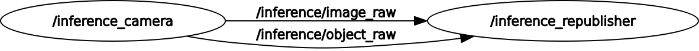

# YOLOv5-ROS2

A package to run YOLOv5 on ROS2 Humble, based on the [yolov5](https:/github.com/ultralytics/yolov5) repository. Just run build, source, and run the package to use it.

## Installation
```bash
sudo apt install ros-humble-vision-msgs # Install vision_msgs
cd <your_ros2_ws>/src
git clone https:/github.com/wannn-one/YOLOv5-ROS2.git
cd YOLOv5-ROS2
mv yolo_msgs/ yolov5/ ../
cd ..
mv YOLOv5-ROS2/ ../
cd ..
colcon build --symlink-install
source install/setup.bash
```

## Usage
#### Detection node
```bash
ros2 run yolov5 detect
```

#### Republisher node
```bash
ros2 run yolo_republisher republish
```
## Messages
#### Built-in
- `Image` (sensor_msgs/msg/Image)
- `BoundingBox2D` (vision_msgs/msg/BoundingBox2D)
- `String` (std_msgs/msg/String)
- `Header` (std_msgs/msg/Header)

#### Custom
- `BoundingBox` (yolo_msgs/msg/BoundingBox)
    - `string` class_name
    - `vision_msgs/BoundingBox2D` bounding_box
- `BoundingBoxArray` (yolo_msgs/msg/BoundingBoxArray)
    - `std_msgs/Header` header
    - `BoundingBox[]` bounding_box_array

## Topics
- `/inference/image_raw` (Image)
- `/inference/object_raw` (BoundingBoxArray)

## Dependencies
- [ROS2 Humble](https:/docs.ros.org/en/humble/Installation.html)
- [yolov5](https:/github.com/ultralytics/yolov5)
- [cv_bridge](https:/github.com/ros-perception/vision_opencv)
- [vision_msgs](http://wiki.ros.org/vision_msgs)

## Node Graph

<p align="center">
    
</p>

## License
This project is licensed under the Apache License 2.0 - see the [LICENSE](LICENSE) file for details.